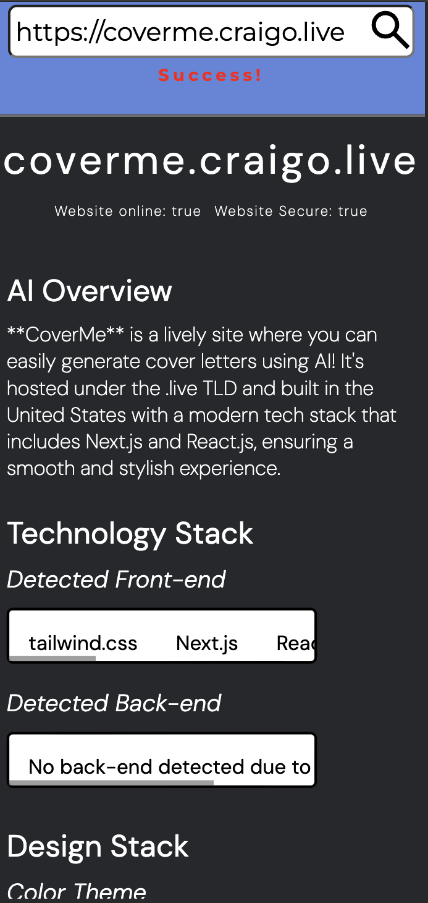
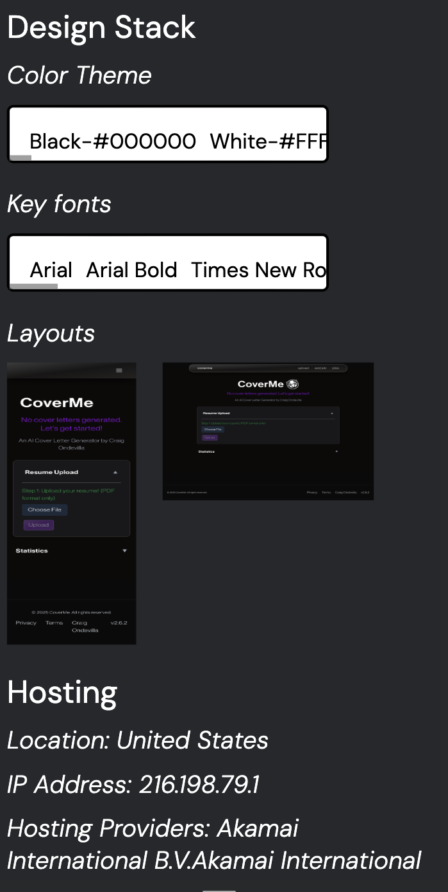
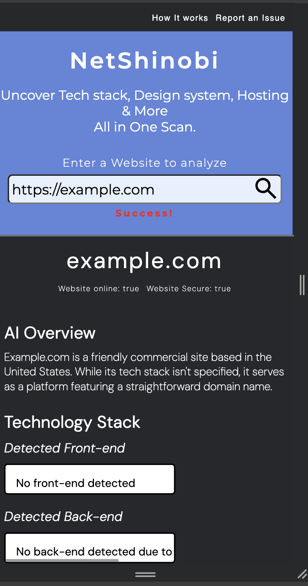
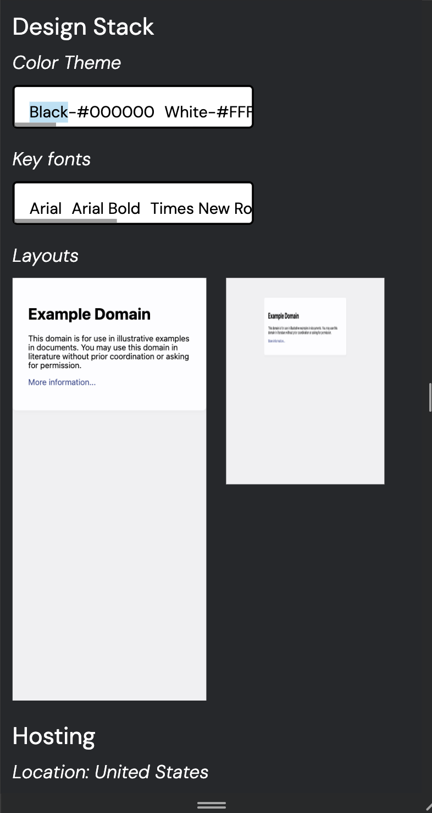

<h2 align="center"> NetShinobi 🌀 </h2>
NetShinobi is a web intelligence tool that extracts useful info about any website. It helps developers and designers see what’s behind the page like tech stack, design elements, and even security status.

## 🌐 Live Site

https://netshinobi-web-analyzer.up.railway.app  
[Search/scrape functions can be slow due to the the way cloud hosting platforms handle web scraping]  
Run locally for extremly fast results

## Features

<li> Tech stack detection (frontend & backend)</li>
<li> Scrapes contact page contents</li>
<li> SSL (HTTPS) check</li>
<li> IP and hosting location detection</li>
<li> Font and color palette extraction</li>
<li> CSS framework detection (Tailwind, Bootstrap, etc.)</li>
<li> Favicon scraper</li>
<li> AI-generated site overview</li>
<li> Online status check (via ping)</li>
<li> TLD identification (.com, .org, etc.)</li>

## Tech Stack

<li> Node.js</li>
<li> Puppeteer</li>
<li> Cheerio</li>
<li> MongoDB</li>
<li> Express</li>
<li> Html,Css </li>

## Screenshots

<<<<<<< HEAD
|  |  |
|-------------------------------------------|---------------------------------------------|
|  |  |
=======

Coming soon...

> > > > > > > c048ea3 (Retrial)

## How to Run Locally

Clone the repository and navigate into its folder.  
Run `npm install` to install dependencies.  
In your package.json, ensure the start script is set to `"start": "node --watch --env-file=.env index"`.  
Add your `.env` file to the root directory with the required environment variables.  
Start the app with `npm run start`.  
Open your browser and go to `http://localhost:3000`.

